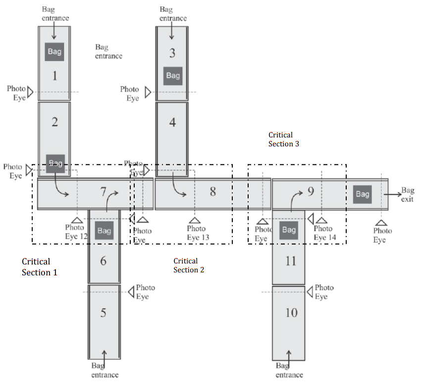
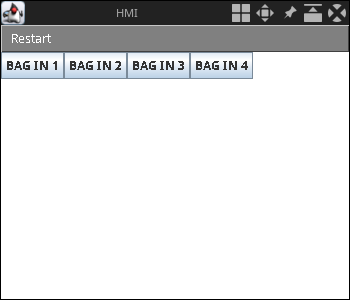

# COMPSYS 725 Assignment 2

The second assignment for COMPSYS 725 at the University of Auckland. The assignment is concerned with mutual exclusion algorithms implemented via a simulation
tool for Functional Blocks [FDBK](http://ftp.holobloc.com/fbdk2/index.htm). In
particular, the mutual exclusion algorithms considered are:
* Central Server
* Ring Token
* Multicast

## Critical Sections

Critical section 1 (with conveyors 2 and 6 feeding into conveyor 7) uses the Central Server implementation to manage mutual exclusion. 
Critical section 2 (with conveyors 4 and 7 feeding into conveyor 8) uses the Ring Token implementation to manage mutual exclusion.
Critical section 3 (with conveyors 8 and 11 feeding into conveyor 9) uses the Multicast implementation to manage mutual exclusion.

## Running the BHS

In order to run this project, navigate to the `fbdk` directory via terminal. Once inside, simply run:
```
java -jar editor.jar
```
You will need to accept the terms and conditions before proceeding. Once in the main window, open the main file located at `cs725/BaggageSystemCTL.sys`. After successfully loading that file into the editor, launch the configuration using the green play button on the top bar. You can expect to see two windows; a view window illustrating the arrangement of conveyors and an 'HMI' window which will allow the spawning of bags in the system. Bag 1 sends a bag onto conveyor 1, Bag 2 sends a bag onto conveyor 5, Bag 3 sends a bag onto conveyor 3, Bag 4 sends a bag onto conveyor 10.



## Contributors

Each mutual exclusion algorithm was implemented by a different individual, with Kazuki Saegusa handling Central Server, Rishab Goswami handling Ring Token and Matt Eden handling Multicast.

<table>
  <tr>
    <td align="center"><a href="https://github.com/kaplunket"><br /><sub><b>Kazuki Saegusa</b></sub></a><br /></td>
    <td align="center"><a href="https://github.com/rishab-goswami"><br /><sub><b>Rishab Goswami</b></sub></a><br /></td>
    <td align="center"><a href="https://github.com/Matteas-Eden"><br /><sub><b>Matt Eden</b></sub></a><br /></td>
  </tr>
</table>

